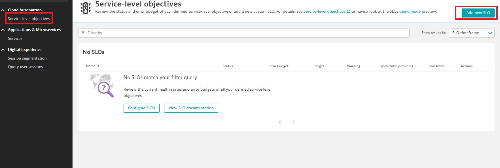

# Hands on #1 – Let’s create an SLO in our Dynatrace environments
### Situation: You are a SRE tasked with defining and tracking a SLO for a new frontend service that has recently been introduced into the application you’re responsible for. After consulting with business partners and app owners, the team has agreed on SLIs and error budgets. 
<br/><br/>

1. First, navigate and log in to your Dynatrace environment provided to you ahead of class. If you’re having issues, please raise your hand or ask an instructor for help. 
2. Navigate to the SLO page found on your side menu inside Dynatrace.
3. Click on add new SLO


4. We’ve now entered the Dynatrace configuration wizard. Because we’re making a simple availability SLO, we can just click this button and Dynatrace will autofill the appropriate metrics to look for.
5. Dynatrace will fill the metric expression with a templated example. You should see a string similar to this:</br></br>
```
(100)*(builtin:service.errors.server.successCount:splitBy())/(builtin:service.requestCount.server:splitBy())
```
</br></br>
